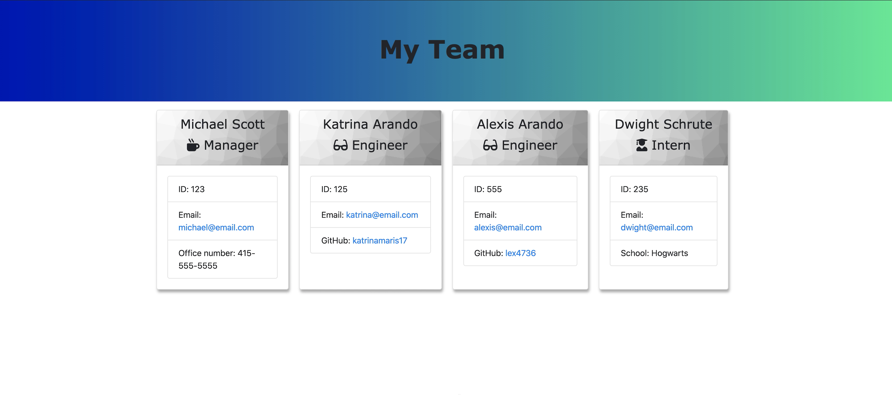
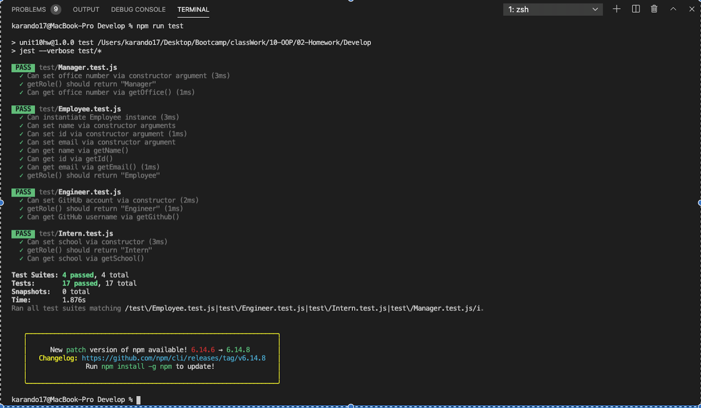
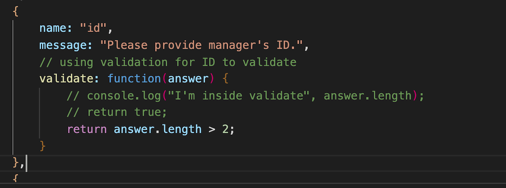
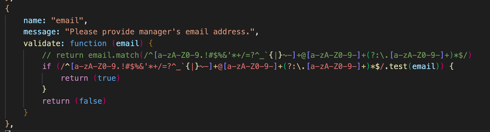

# Software Engineering Team Generator - Node CLI

This app is a team generator command line application. When deployed, the user is prompted for information about the team manager and members.  The user can input any number of members as well as mix of engineers and interns. Once user input is complete, the application renders the information provided into an styled HTML file to generate a team roster.  

## Instructions

* To use this application, you must have Node installed in your machine.

* Clone the app and run the "npm i" command. 

* Run the node app command to deploy the application.  

* User input will be generated in the result.html file

## Product Demo

## Tests

* Testing is ran through [jest](https://jestjs.io/). Testing can be done executed anytime through "npm run test". 

## Validation 
* Sample validations ran to ensure the information is in proper format. 

## Contributors
* This application was created with the help of a TA and tutor. 
